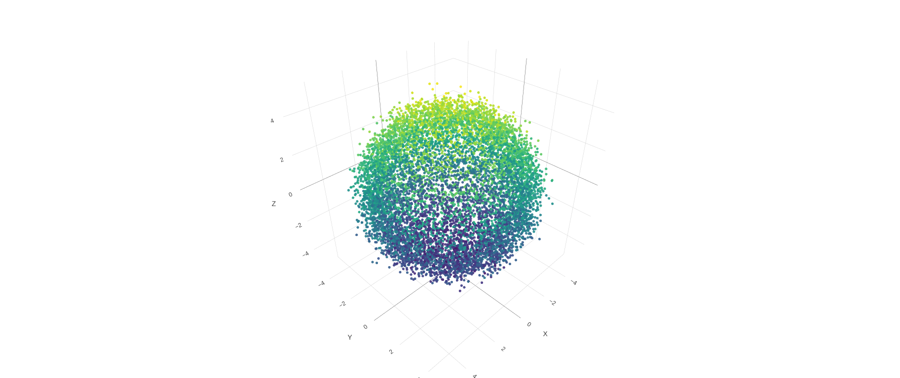
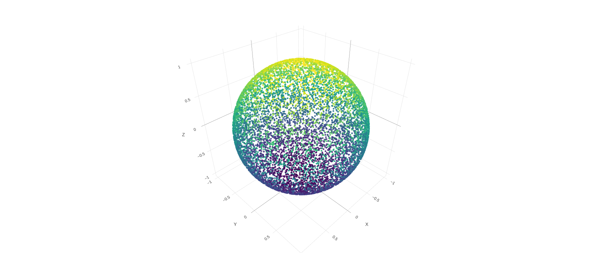
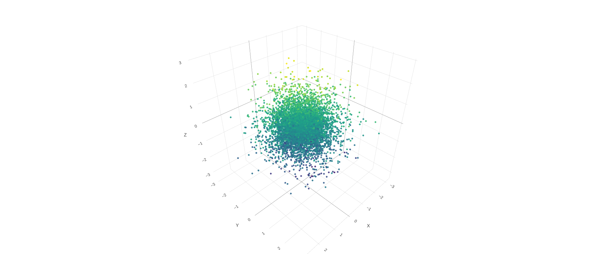
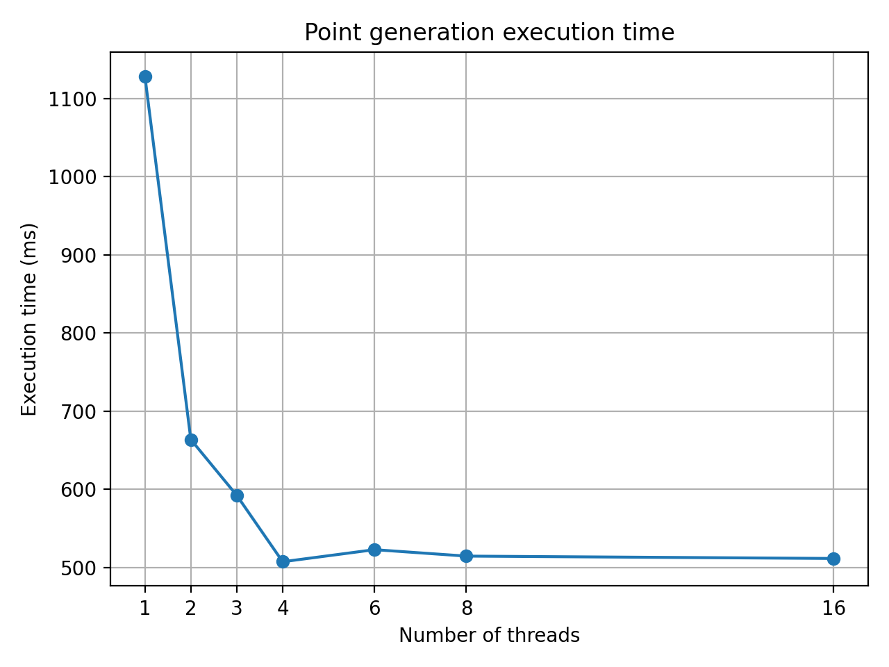
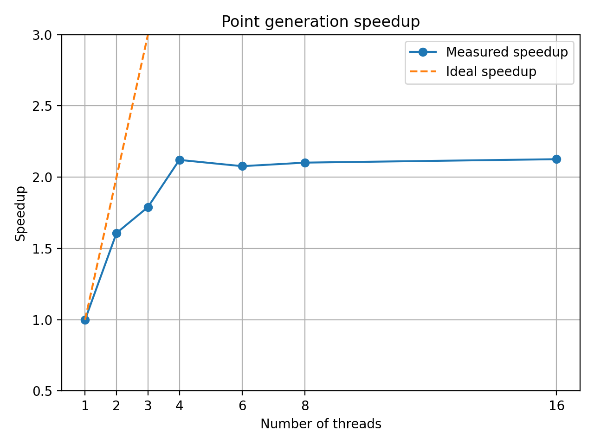

# PointCreator

A multithreaded C++ program for generating random points in 3D around a user-defined center.

The distance of each point from the center follows a normal distribution, while the direction is uniformly distributed over the sphere. The point generation step is parallelized using the C++ Standard Library and its execution time is measured.

## Background

This project was initially developed as part of a technical interview exercise and was later revisited as a personal project to revisit the fundamentals and improve the overall implementation and usability.

A version of the original exercise formulation can be found in `.original_formulation.txt`, which even though outdated, gives some hints about the initial direction of the project.

## Overview

PointCreator generates a configurable number of random points around a 3D center point.

Each point is defined by:

* its **distance** from the center;
* its **direction** from the center.

The radial distance follows a normal distribution:

* `R_mean` defines the mean distance from the center;
* `R_dev` defines the standard deviation.

The direction is uniformly distributed over the surface of a sphere, ensuring that there is no preferred direction in 3D space. This makes it possible to generate different types of 3D point distributions, from spherical shells to more dispersed point clouds, depending on the chosen radial distribution.


*Figure: Point cloud generated with the `input/default.txt` input file, visualized with the interactive viewer `images/plot_csv.html`.*

### Edge cases

* `R_dev = 0`: points uniformly distributed on the surface of a sphere with radius `R_mean`
* `R_mean = 0`: points are clustered around the center
* `R_mean = 0` and `R_dev = 0` simultaneously is not allowed


*Figure: Spherical shell generated with the `input/no_std.txt` input file, visualized with the interactive viewer `images/plot_csv.html`.*


*Figure: Point cloud generated with the `input/no_R.txt` input file, visualized with the interactive viewer `images/plot_csv.html`.*

## Features

* Random 3D point generation
* Uniform distribution of the points on the sphere of `R_mean` when `R_dev = 0`.
* Configurable center point
* Configurable number of points
* Multithreaded point generation using the C++ Standard Library
* Execution-time measurement of the generation step
* Text output compatible with the specification
* Performance benchmarking and scalability analysis

## Input

The program reads the parameters of the simulation from an input file, which should contain the following `keys` separated with a colon (`:`) from their arithmetic values:

| Parameter             | Description                                  |
| --------------------- | -------------------------------------------- |
| `number of threads`   | Number of threads used for point generation  |
| `number of points`    | Number of points to generate                 |
| `center x-coordinate` | x coordinate of the center                   |
| `center y-coordinate` | y coordinate of the center                   |
| `center z-cooridnate` | z coordinate of the center                   |
| `radius mean value`   | Mean radial distance                         |
| `standard deviation`  | Standard deviation of the radial distance    |

`radius mean value` and `standard deviation` cannot both be zero.

A set of valid inputs can be found inside the `./input` directory.

### Example

Let us suppose an input file named `default.txt` with the following content:

```text
number of threads: 1 
number of points:  10000 

center x-coordinate: 0.0 
center y-coordinate: 0.0 
center z-coordinate: 0.0 

radius mean value:  4.0 
standard deviation: 0.4
```

The program creates 10000 points uniformly distributed on a sphere of radius 4 centered at the origin and standard deviation 0.4, using a single thread. The output is written in `res/default.csv`, using the following format:

```text
<x_1>, <y_1>, <z_1>
<x_2>, <y_2>, <z_2>
...
```

## Point Generation

For each generated point, a radial distance is sampled from the specified normal distribution and a uniformly distributed direction is generated.

The resulting Cartesian coordinates are obtained by combining the sampled radius, direction and center position.

The point-generation stage is divided between multiple worker threads. Each thread generates an independent subset of the requested points.

## Build and execution

```bash
git clone <repository-url>
cd PointCreator

# Build instructions:
make release 
make debug

# Execution:
./build/pc.out input/default.txt
```

## Multithreading

Point generation is parallelized using the C++ Standard Library threading facilities.

The workload is divided between the requested number of threads, with each thread responsible for generating its own portion of the point cloud.

Random-number generation is kept thread-local to avoid unnecessary synchronization between worker threads.

This design allows the computational workload to scale across multiple CPU cores while avoiding a shared random-number generator..

## Performance

The point-generation stage is timed independently in order to measure the computational part of the program. Benchmarking is performed by keeping the problem size fixed and increasing the number of threads.

For a given number of threads `N`, speedup is measured relative to the single-threaded execution:

```text
Speedup(N) = T(1) / T(N)
```

where `T(N)` is the point-generation execution time using `N` threads.

## Benchmarking

Benchmarking is automated using a Python script that:

* generates benchmark input files for different thread counts;
* executes the C++ program repeatedly;
* extracts the measured execution time;
* computes median execution times and speedups;
* generates the execution-time and speedup plots.

The benchmark scripts are intended as measurement tooling; the point-generation implementation itself is entirely C++.

To run the benchmark:

```bash
python3 scripts/benchmark.py
```

Results will be available in `benchmark` directory.

## Benchmark results





Benchmark configuration:

* CPU: Intel Core i7-7Y75 (2 physical cores, 4 logical CPUs)
* Compiler: GCC
* Compiler version: 11.4.0
* Build type: Release
* Compiler flags: -O3 -DNDEBUG -march=native -pthread
* Number of generated points: 5,000,000
* Operating system: Ubuntu 22.04.5 LTS

## Design Considerations

The implementation focuses on keeping the computational part independent from output and synchronization.

In particular:

* worker threads generate points independently;
* random-number generators are local to each thread;
* synchronization is minimized;
* file output is performed separately from the computational kernel;
* memory is allocated before parallel execution when possible.

These choices allow the benchmark to focus on the scalability of the point-generation algorithm rather than on file I/O.